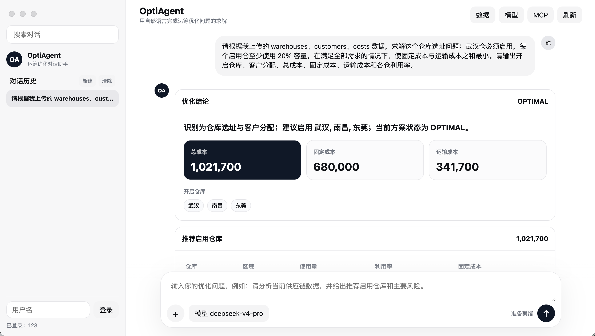
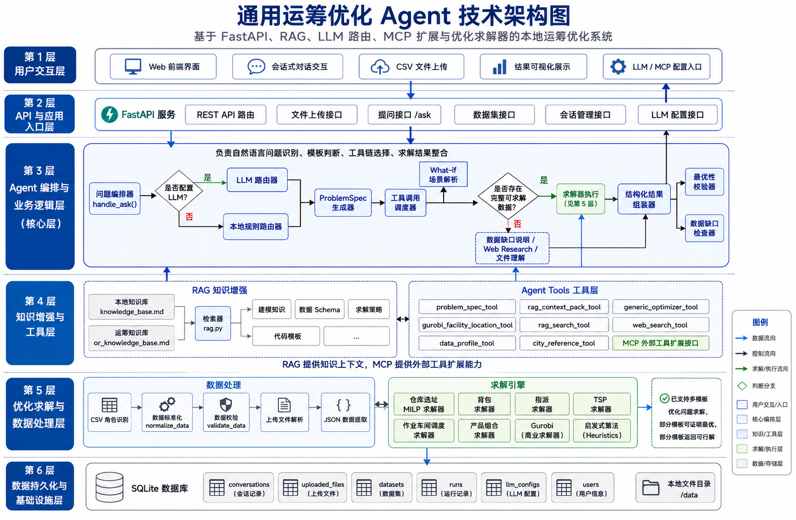

# OptiAgent

> 一个面向运筹优化场景的本地 Agent 系统：支持自然语言提问、CSV/JSON 数据输入、RAG 建模知识检索、工具调用与优化求解。

> A local-first optimization agent for operations research workflows, combining natural language understanding, structured modeling, RAG, solver execution, and explainable results.


该项目尝试把 **自然语言理解、结构化建模、RAG、工具路由、求解器执行、结果解释** 串成一条完整闭环，让用户可以像和分析助手对话一样提出优化问题，并得到可审计、可解释、可执行的求解结果。

## 目录

- [Why This Repo](#why-this-repo)
- [Who Is This For](#who-is-this-for)
- [典型使用场景](#典型使用场景)
- [项目的优势](#项目的优势)
- [效果图](#效果图)
- [架构图](#架构图)
- [当前能力](#当前能力)
- [已支持的可执行问题](#已支持的可执行问题)
- [系统如何工作](#系统如何工作)
- [CSV 处理策略](#csv-处理策略)
- [工具体系](#工具体系)
- [快速开始](#快速开始)
- [Examples](#examples)
- [Roadmap](#roadmap)
- [Community](#community)
- [项目结构](#项目结构)
- [数据示例](#数据示例)

## Why This Repo

- It shows how an OR agent can go beyond chat and reach actual solver execution.
- It combines natural language input, CSV/JSON ingestion, local RAG, tool routing, and optimization solvers in one repo.
- It is useful both as a demo system and as a starting point for people building optimization agents, solver copilots, or domain-specific decision assistants.

## Who Is This For

- 想做“运筹优化 Agent / OR Copilot / 求解助手”的开发者
- 需要把 LLM、RAG、结构化数据和 MILP/启发式求解串起来的研究者
- 想把自然语言前端接到优化后端的课程项目、毕业设计或原型项目作者
- 希望了解“从前端上传数据到后端建模求解”完整链路的同学

## 典型使用场景

- 用自然语言描述仓库选址、生产计划、作业车间调度、指派、背包、TSP 等问题
- 上传业务 CSV，让系统自动识别数据角色、完成字段标准化并调用求解器
- 借助本地 RAG 为建模、字段要求、求解策略提供解释依据
- 将该仓库作为运筹 Agent 的最小可行原型，继续扩展新模板、新工具、新求解器

## 项目的优势

- 支持自然语言驱动的运筹优化求解，而不要求用户先写数学模型。
- 支持多类问题模板。
- 支持上传 CSV，并自动识别数据角色、标准化字段、校验可行性。
- 使用本地 RAG 提供建模依据、数据 Schema、求解策略和代码模板。
- 配置 LLM 后可进行更柔性的路由与工具调度；未配置时也能本地规则兜底。
- 结果展示问题类型、RAG 依据、Agent 步骤、决策表和风险提示。

## 效果图



## 架构图



## 当前能力

### 1. 问题理解与建模

- 将自然语言问题转换为 `ProblemSpec`
- 输出目标函数、变量、约束、数据要求和推荐求解器
- 支持 LLM 路由与本地规则路由双模式

### 2. RAG 知识增强

- 检索 `optiagent/knowledge_base.md`
- 检索 `optiagent/or_knowledge_base.md`
- 为每次求解提供：
  - 建模知识
  - 数据 Schema
  - 代码模板
  - 求解策略

### 3. 工具调用与求解

- 根据问题模板自动调用对应求解工具
- 对求解结果做最优性/可行性标记
- 对真实数据类问题支持 Web Research 证据检索
- 支持 MCP 外部工具接入

### 4. 数据与对话管理

- 支持 CSV 上传、完整内容保存和预览
- 支持按会话隔离上传文件、结构化数据集与运行记录
- 支持多轮追问，不同问题文件不会相互污染

### 5. 结果展示

- 结构化结论
- 流式回答输出
- 指标卡片
- 决策表
- 风险提示
- RAG 命中文档
- Agent 工具调用轨迹

## 已支持的可执行问题

| 模板 | `template_id` | 数据入口 | 求解方式 | 结果状态 |
| --- | --- | --- | --- | --- |
| 仓库选址与客户分配 | `facility_location` | 三个 CSV：`warehouses/customers/costs` | Gurobi MILP | `OPTIMAL`、`NEAR_OPTIMAL` 或 Gurobi 状态 |
| 0-1 背包 | `knapsack` | JSON 或 CSV：`item/value/weight` | Gurobi IP | `OPTIMAL` 或 `NEAR_OPTIMAL` |
| 指派匹配 | `assignment` | JSON 或 CSV：`resource/task/cost` | Gurobi MILP | `OPTIMAL` 或 `NEAR_OPTIMAL` |
| 旅行商路径 | `tsp` | JSON 或 CSV：`from/to/distance`；或坐标 CSV：`City/X/Y` | 精确枚举 / Held-Karp / Gurobi MILP / 多起点 2-opt 近似 | `OPTIMAL`、`NEAR_OPTIMAL` 或 `FEASIBLE` |
| 作业车间调度 | `job_shop_scheduling` | JSON 或 CSV：`job/machine/duration/order` | Gurobi MILP / 列表调度兜底 | `OPTIMAL`、`NEAR_OPTIMAL` 或 `FEASIBLE` |
| 产品组合与生产计划 | `production_mix` | JSON 或 CSV：`product/profit/资源列 + capacities` | Gurobi LP/MILP | `OPTIMAL` 或 `NEAR_OPTIMAL` |

说明：运输分配、VRP/VRPTW 等内容目前保留在 RAG 知识库中作为建模参考，还不是活跃自动求解模板。

### 求解质量策略

- Gurobi 类模型统一使用时间限制和 MIPGap 策略，默认尽量证明 `OPTIMAL`。
- 当大规模 MILP 在时间限制内未完全证明最优但 gap 达到阈值时，系统标记为 `NEAR_OPTIMAL`，并在 Agent 工作过程里说明 gap 与最优性状态。
- TSP 小规模使用精确枚举或 Held-Karp 动态规划；中等规模优先使用 Gurobi MILP 争取证明 `OPTIMAL` 或 `NEAR_OPTIMAL`；更大规模使用多起点最近邻构造加 2-opt 局部搜索，返回高质量可行解并明确未证明全局最优。
- 作业车间调度优先使用 Gurobi MILP 证明最优或接近最优；规模过大或精确求解器不可用时回退到列表调度启发式，并标记为 `FEASIBLE`。
- 结果页会优先展示目标值、关键成本、MIP Gap 和最优性证明状态；Agent 工具调用过程作为可展开审计信息。
- 可通过环境变量调整默认策略：`OPTIAGENT_TIME_LIMIT`、`OPTIAGENT_MIP_GAP`、`OPTIAGENT_SOLVER_THREADS`、`OPTIAGENT_TSP_EXACT_LIMIT`、`OPTIAGENT_TSP_MILP_LIMIT`、`OPTIAGENT_TSP_LOCAL_SEARCH_LIMIT`、`OPTIAGENT_JOB_SHOP_MILP_LIMIT`。

### 流式输出

- 前端默认调用 `/api/ask/stream`，通过 `fetch + ReadableStream` 接收 SSE 事件。
- 后端会依次推送 `status`、`answer_delta` 和 `final`：用户先看到阶段状态和逐段回答，最终再渲染完整结构化卡片、决策表和 Agent 轨迹。
- `/api/ask` 保留为非流式兼容接口。

## 系统如何工作

```text
用户问题 / 上传数据
  -> LLM 路由器 或 本地规则路由器
  -> ProblemSpec 结构化建模
  -> RAG 检索
  -> 数据解析与校验
  -> 求解器执行
  -> 最优性检查
  -> 结构化结果输出
```

对于仓库选址等供应链问题，系统支持：

- 基准场景求解
- `what-if` 修改
- 成本变化解释
- 启用仓库与客户分配展示

## CSV 处理策略

上传 CSV 后，系统不会直接把文件“丢给模型猜”。它会先做结构化处理：

1. 读取 CSV，并兼容 `utf-8-sig / utf-8 / gb18030 / gbk`
2. 根据列名语义和文件内容识别数据角色
3. 保存完整 CSV 和预览到当前会话
4. 对仓库选址三张表执行标准化和校验
5. 如果数据完整，生成结构化数据集并激活求解链路
6. 提问时再由 Agent 按模板解析和调用求解器


## 工具体系

项目内置的核心工具包括：

- `problem_spec_tool`
- `rag_context_pack_tool`
- `generic_optimizer_tool`
- `gurobi_facility_location_tool`
- `rag_search_tool`
- `web_search_tool`
- `data_profile_tool`
- `city_reference_tool`

这些工具主要定义在 [optiagent/langchain_agents.py](optiagent/langchain_agents.py) 中，负责连接自然语言理解、知识检索、数据分析与求解执行。

## 快速开始

推荐使用启动脚本：

```bash
./start.sh
```

指定端口：

```bash
PORT=8010 ./start.sh
```

首次运行：

```bash
python3 -m venv .venv
source .venv/bin/activate
pip install -r requirements.txt
```

手动启动：

```bash
uvicorn api.main:app --reload --host 127.0.0.1 --port 8000
```

浏览器打开：

```text
http://127.0.0.1:8000
```

## Examples

可直接体验的示例放在 [examples/README.md](/Users/tianyuanzhe/运筹优化/examples/README.md)：

- 仓库选址：使用 `data/facility_location_*.csv`
- 指派问题：使用 [examples/assignment_sample.json](/Users/tianyuanzhe/运筹优化/examples/assignment_sample.json)
- 作业车间调度：使用 [examples/job_shop_scheduling_sample.json](/Users/tianyuanzhe/运筹优化/examples/job_shop_scheduling_sample.json)
- 产品组合：使用 [examples/production_mix_sample.json](/Users/tianyuanzhe/运筹优化/examples/production_mix_sample.json)

如果你是第一次了解这个项目，建议先从 `facility_location` 或 `assignment` 开始，最容易看到完整的上传、建模、求解与结果展示链路。

## Roadmap

- 扩展更多活跃可执行模板：VRP、VRPTW、网络流、排班、鲁棒优化
- 提升模糊问题下的 LLM 规划与追问能力
- 增强多文件联合解析、自动 schema 对齐与数据纠错
- 引入更多可插拔求解器与更细粒度的 solver routing
- 完善 benchmark、案例集与评测脚本，支持更稳定的 Agent 能力验证

## Community

- 仓库变更记录见 [CHANGELOG.md](/Users/tianyuanzhe/运筹优化/CHANGELOG.md)
- 贡献方式见 [CONTRIBUTING.md](/Users/tianyuanzhe/运筹优化/CONTRIBUTING.md)
- 如果你也在做 OR Agent、Optimization Copilot、Decision Intelligence 或 Solver + LLM 结合的方向，欢迎基于这个仓库继续扩展

## 运行依赖

- Python 3.11+
- FastAPI / Uvicorn
- pandas / numpy
- gurobipy
- requests
- langchain / langchain-openai / langchain-mcp-adapters
- SQLite

如果本机没有有效 Gurobi license，相关模板会返回不可用状态

## 项目结构

```text
api/
  main.py                  FastAPI 路由、上传、配置入口
  database.py              SQLite 持久化
  services/ask_service.py  提问编排、RAG、数据解析、工具调用响应

optiagent/
  problem_spec.py          ProblemSpec 数据结构
  templates/registry.py    问题模板与自动识别
  solver_registry.py       通用求解器注册表
  generic_solvers.py       背包、指派、TSP、调度、产品组合求解器
  solver.py                仓库选址 Gurobi MILP
  rag.py                   本地 Markdown RAG 检索
  langchain_agents.py      LangChain Supervisor Agent 与 MCP 工具加载
  scenario.py              what-if 场景修改与结果解释
  llm.py                   OpenAI-compatible Chat Completions 调用
  data.py                  数据规范化和校验
  web_research.py          网页检索

web/
  index.html
  app.js
  styles.css

data/
  01_knapsack_data.csv
  tsp.csv
  china_city_reference.csv
```

## 数据示例

### 0-1 背包 CSV

```csv
物品编号,重量,价值
1,2,3
2,3,4
3,4,8
4,5,8
5,9,10
6,7,6
```

提问：

```text
有一个容量为 15 的背包，每个物品最多选一次，求最大价值。
```

### 指派 JSON

```json
{
  "resources": ["员工A", "员工B"],
  "tasks": ["早班", "晚班"],
  "costs": [
    {"resource": "员工A", "task": "早班", "cost": 3},
    {"resource": "员工A", "task": "晚班", "cost": 8},
    {"resource": "员工B", "task": "早班", "cost": 5},
    {"resource": "员工B", "task": "晚班", "cost": 4}
  ]
}
```

### TSP JSON

```json
{
  "distances": [
    {"from": "A", "to": "B", "distance": 4},
    {"from": "A", "to": "C", "distance": 2},
    {"from": "B", "to": "C", "distance": 5},
    {"from": "B", "to": "D", "distance": 10},
    {"from": "C", "to": "D", "distance": 3},
    {"from": "A", "to": "D", "distance": 7}
  ]
}
```

### 作业车间调度 JSON

```json
{
  "tasks": [
    {"job": "J1", "machine": "M1", "duration": 3, "order": 1},
    {"job": "J1", "machine": "M2", "duration": 2, "order": 2},
    {"job": "J2", "machine": "M2", "duration": 2, "order": 1},
    {"job": "J2", "machine": "M1", "duration": 4, "order": 2}
  ]
}
```

### 产品组合 JSON

```json
{
  "products": [
    {"product": "A", "profit": 30, "labor": 2, "material": 1},
    {"product": "B", "profit": 40, "labor": 1, "material": 3}
  ],
  "capacities": {
    "labor": 100,
    "material": 90
  }
}
```

### 仓库选址 CSV

`warehouses.csv`

```csv
warehouse,region,capacity,fixed_cost,min_open_ratio,force_open,force_closed
Shanghai,华东,1200,3600,0.20,0,0
Beijing,华北,900,2600,0.15,0,0
```

`customers.csv`

```csv
customer,demand
Hangzhou,420
Nanjing,360
```

`costs.csv`

```csv
warehouse,customer,cost
Shanghai,Hangzhou,2.1
Shanghai,Nanjing,2.5
Beijing,Hangzhou,4.6
Beijing,Nanjing,4.2
```

## LLM 与 MCP 配置

页面中可填写 OpenAI-compatible Chat Completions 配置：

- Base URL
- 模型名
- API Key
- Temperature

MCP 配置示例：

```json
{
  "math": {
    "command": "python",
    "args": ["server.py"],
    "transport": "stdio"
  }
}
```

未配置 LLM 时，系统仍可运行本地 ProblemSpec、RAG、数据解析和求解器调用链路。

## 验证命令

```bash
python3 -m compileall api optiagent
node --check web/app.js
```
