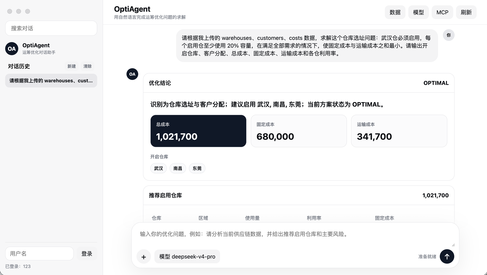
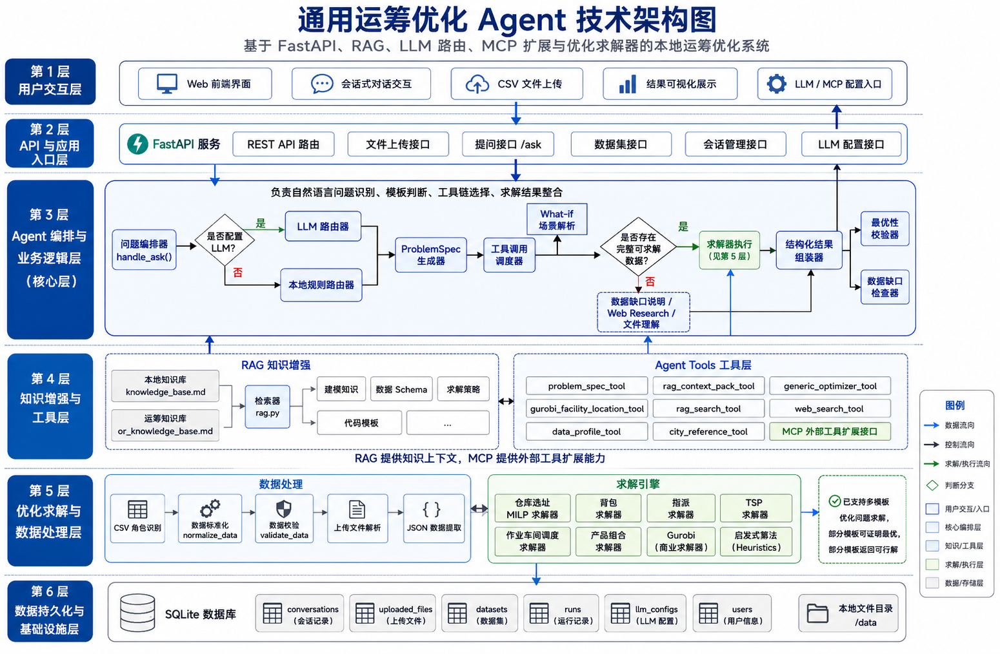

# OptiAgent

> 一个面向运筹优化场景的 Agentic 系统：学习如何规划建模、选择工具、调用求解器并验证结果。

> A local-first optimization agent for operations research workflows, combining natural language understanding, structured modeling, RAG, solver execution, and explainable results.


该项目尝试把 **自然语言理解、结构化建模、RAG、工具路由、求解器执行、结果验证与策略学习** 串成一条完整闭环，让用户可以像和分析助手对话一样提出优化问题，并得到可审计、可解释、可执行的求解结果。

项目的长期研究问题是：

$$
\boxed{\text{Learning an Agent Policy for Automated Optimization Modeling and Solving}}
$$

重点不只是让 LLM “生成一个模型”，而是学习一个可评估、可改进的 Agent policy，使系统能在澄清、检索、建模、工具选择、求解、验证和修复之间作出序列决策。完整定义见 [研究方向文档](docs/research-direction.md)。

## 目录
- [Who Is This For](#who-is-this-for)
- [典型使用场景](#典型使用场景)
- [项目的优势](#项目的优势)
- [效果图](#效果图)
- [架构图](#架构图)
- [研究目标](#研究目标)
- [当前能力](#当前能力)
- [已支持的可执行问题](#已支持的可执行问题)
- [系统如何工作](#系统如何工作)
- [CSV 处理策略](#csv-处理策略)
- [工具体系](#工具体系)
- [快速开始](#快速开始)
- [Examples](#examples)
- [Roadmap](#roadmap)
- [Community](#community)
- [项目结构](#项目结构)
- [数据示例](#数据示例)

## Who Is This For

- 想做“运筹优化 Agent / OR Copilot / 求解助手”的开发者
- 需要把 LLM、RAG、结构化数据和 MILP/启发式求解串起来的研究者
- 想把自然语言前端接到优化后端的课程项目、毕业设计或原型项目作者
- 希望了解“从前端上传数据到后端建模求解”完整链路的同学

## 典型使用场景

- 用自然语言描述仓库选址、生产计划、作业车间调度、指派、背包、TSP 等问题
- 上传业务 CSV，让系统自动识别数据角色、完成字段标准化并调用求解器
- 借助本地 RAG 为建模、字段要求、求解策略提供解释依据
- 将该仓库作为运筹 Agent 的最小可行原型，继续扩展新模板、新工具、新求解器

## 项目的优势

- 支持自然语言驱动的运筹优化求解，而不要求用户先写数学模型。
- 支持多类问题模板。
- 支持上传 CSV，并自动识别数据角色、标准化字段、校验可行性。
- 使用本地 RAG 提供建模依据、数据 Schema、求解策略和代码模板。
- 配置 LLM 后可进行更柔性的路由与工具调度；未配置时也能本地规则兜底。
- 结果展示问题类型、RAG 依据、Agent 步骤、决策表和风险提示。

## 效果图



## 架构图



当前执行层使用 LangGraph 编排 `Requirement Analyst → Planner → Data Agent → Modeler → Solver → Verifier → Policy → Explainer`。Requirement Analyst 会跨轮累积目标、约束、数据和未决问题；Policy 可根据验证反馈返回 Modeler/Solver；MCP 层拆分为 Document / Data / Solver 三个可独立运行的服务。详细设计见 [Agent 工作流](docs/agent-workflow.md)、[MCP 架构文档](docs/mcp-architecture.md) 与 [多轮 Agent 路线](docs/multi-turn-agent-roadmap.md)。

## 研究目标

OptiAgent 的长期方向由两条相互闭环的主线组成：第一部分是当前正在开发的 Agent System，学习规划、MCP 工具路由、求解控制和失败恢复；第二部分是在云端部署开源语言模型，并使用 SFT + GRPO 后训练其运筹建模、结构化工具调用和反馈修复能力。Solver 与 Verifier 为两条主线提供统一、可执行且可复算的环境反馈。

两部分的训练对象不同：当前 BC + Masked Double DQN 学习结构化状态上的高层 Agent 动作；未来 GRPO 学习的是开源语言模型的 token/结构化输出策略。项目早期将交替固定其中一侧进行训练，避免 Agent 与模型同时更新造成非平稳训练。

当前已在可控 Recovery Benchmark 上训练出第一个 BC + Masked Double DQN policy，并逐步扩展到六类真实 Gateway/Solver/Verifier 结果和真实 MCP stdio 故障轨迹。最新 40 维 transport-aware 策略能够区分正常返回、超时、子进程断连和非法结构返回，在独立 test split 上恢复全部可恢复任务且非法动作率为 0。它尚未接管生产 LangGraph，也不代表已学会通用优化建模；更准确的定位是“已打通真实工具故障采集与策略学习闭环的可验证 Optimization Agent 原型”。

完整的双主线架构、数据闭环、训练边界与里程碑见 [双主线总体路线](docs/two-track-roadmap.md)。

## 当前能力

### 1. 问题理解与建模

- 将自然语言问题转换为 `ProblemSpec`
- 在求解前将多轮对话合并为结构化 `RequirementBrief`，记录已确认事实、假设和待澄清项
- 当问题类型、目标、约束或数据不完整时主动追问，并阻止误调 Solver
- 输出目标函数、变量、约束、数据要求和推荐求解器
- 支持 LLM 路由与本地规则路由双模式
- 通过 LangGraph 保存八个职责节点及需求澄清、有界恢复回路的执行轨迹
- 记录 Policy 候选动作、action mask、实际动作和恢复原因
- 将每次运行记录为版本化 episode，并提供离线 RL/行为克隆 transition 导出
- 通过六类真实求解实例测试 Gateway、Solver、Schema Validation 和 SolutionVerifier

### 2. RAG 知识增强

- 检索 `optiagent/knowledge_base.md`
- 检索 `optiagent/or_knowledge_base.md`
- 为每次求解提供：
  - 建模知识
  - 数据 Schema
  - 代码模板
  - 求解策略

### 3. 工具调用与求解

- 根据问题模板自动调用对应求解工具
- 对求解结果做最优性/可行性标记
- 对六类模板独立复算约束和目标值，并生成可审计的确定性 reward
- 对真实数据类问题支持 Web Research 证据检索
- 内置 Document MCP、Data MCP 和 Solver MCP，并支持外部 MCP 服务接入
- MCP 服务部分故障时可按服务降级，不会因单个连接失败丢失全部工具

### 4. 数据与对话管理

- 支持 CSV 上传、完整内容保存和预览
- 支持按会话隔离上传文件、结构化数据集与运行记录
- 支持按会话持久化多轮需求状态，补充信息后可继承上一轮目标和约束

### 5. 结果展示

- 结构化结论
- 流式回答输出
- 指标卡片
- 决策表
- 风险提示
- RAG 命中文档
- Agent 工具调用轨迹

## 已支持的可执行问题

| 模板 | `template_id` | 数据入口 | 求解方式 | 结果状态 |
| --- | --- | --- | --- | --- |
| 仓库选址与客户分配 | `facility_location` | 三个 CSV：`warehouses/customers/costs` | Gurobi MILP | `OPTIMAL`、`NEAR_OPTIMAL` 或 Gurobi 状态 |
| 0-1 背包 | `knapsack` | JSON 或 CSV：`item/value/weight` | Gurobi IP | `OPTIMAL` 或 `NEAR_OPTIMAL` |
| 指派匹配 | `assignment` | JSON 或 CSV：`resource/task/cost` | Gurobi MILP | `OPTIMAL` 或 `NEAR_OPTIMAL` |
| 旅行商路径 | `tsp` | JSON 或 CSV：`from/to/distance`；或坐标 CSV：`City/X/Y` | 精确枚举 / Held-Karp / Gurobi MILP / 多起点 2-opt 近似 | `OPTIMAL`、`NEAR_OPTIMAL` 或 `FEASIBLE` |
| 作业车间调度 | `job_shop_scheduling` | JSON 或 CSV：`job/machine/duration/order` | Gurobi MILP / 列表调度兜底 | `OPTIMAL`、`NEAR_OPTIMAL` 或 `FEASIBLE` |
| 产品组合与生产计划 | `production_mix` | JSON 或 CSV：`product/profit/资源列 + capacities` | Gurobi LP/MILP | `OPTIMAL` 或 `NEAR_OPTIMAL` |

说明：运输分配、VRP/VRPTW 等内容目前保留在 RAG 知识库中作为建模参考，还不是活跃自动求解模板。

### 求解质量策略

- Gurobi 类模型统一使用时间限制和 MIPGap 策略，默认尽量证明 `OPTIMAL`。
- 当大规模 MILP 在时间限制内未完全证明最优但 gap 达到阈值时，系统标记为 `NEAR_OPTIMAL`，并在 Agent 工作过程里说明 gap 与最优性状态。
- TSP 小规模使用精确枚举或 Held-Karp 动态规划；中等规模优先使用 Gurobi MILP 争取证明 `OPTIMAL` 或 `NEAR_OPTIMAL`；更大规模使用多起点最近邻构造加 2-opt 局部搜索，返回高质量可行解并明确未证明全局最优。
- 作业车间调度优先使用 Gurobi MILP 证明最优或接近最优；规模过大或精确求解器不可用时回退到列表调度启发式，并标记为 `FEASIBLE`。
- 结果页会优先展示目标值、关键成本、MIP Gap 和最优性证明状态；Agent 工具调用过程作为可展开审计信息。
- 可通过环境变量调整默认策略：`OPTIAGENT_TIME_LIMIT`、`OPTIAGENT_MIP_GAP`、`OPTIAGENT_SOLVER_THREADS`、`OPTIAGENT_TSP_EXACT_LIMIT`、`OPTIAGENT_TSP_MILP_LIMIT`、`OPTIAGENT_TSP_LOCAL_SEARCH_LIMIT`、`OPTIAGENT_JOB_SHOP_MILP_LIMIT`。

### 流式输出

- 前端默认调用 `/api/ask/stream`，通过 `fetch + ReadableStream` 接收 SSE 事件。
- 后端会推送 `status`、`agent_step`、`answer_delta` 和 `final`：用户可以实时看到八个职责节点的开始、完成或失败状态，最终再渲染完整结构化卡片、决策表和 Agent 轨迹。
- `/api/ask` 保留为非流式兼容接口。

### Trajectory 与训练数据

- `GET /api/agent/episodes`：列出 episode 摘要。
- `GET /api/agent/episodes/{episode_id}`：读取完整审计轨迹。
- `GET /api/agent/episodes/{episode_id}/training`：导出单个 transition 序列。
- `GET /api/agent/training-data`：批量导出完成或失败的训练 episode。
- `OptimizationAgentEnv`：独立于 Web API 的 `reset/step` 恢复策略环境。
- `scripts/generate_rl_dataset.py`：生成可复现 JSONL rollout 数据。

环境定义、动作编号、奖励和 benchmark 指标见 [RL Environment 文档](docs/rl-environment.md)。
真实求解链路的故障矩阵与扩展计划见 [E2E Benchmark 测试计划](docs/e2e-test-plan.md)。
可学习策略的算法选择、状态编码、损失函数和首轮结果见 [Learnable Policy 文档](docs/learning-policy.md)。

## 系统如何工作

```text
用户问题 / 上传数据
  -> LangGraph Agent Policy
     -> Requirement Analyst -> 信息不足：针对性追问
     -> Planner
     -> Data Agent
     -> Modeler
     -> Solver -> MCP Gateway -> Document / Data / Solver MCP
     -> Verifier
     -> Policy -> accept / retry solver / rebuild model / terminate
     -> Explainer
  -> 轨迹与结构化结果持久化
```

对于仓库选址等供应链问题，系统支持：

- 基准场景求解
- `what-if` 修改
- 成本变化解释
- 启用仓库与客户分配展示

## CSV 处理策略

上传 CSV 后，系统不会直接把文件“丢给模型猜”。它会先做结构化处理：

1. 读取 CSV，并兼容 `utf-8-sig / utf-8 / gb18030 / gbk`
2. 根据列名语义和文件内容识别数据角色
3. 保存完整 CSV 和预览到当前会话
4. 对仓库选址三张表执行标准化和校验
5. 如果数据完整，生成结构化数据集并激活求解链路
6. 提问时再由 Agent 按模板解析和调用求解器


## 工具体系

项目内置的核心工具包括：

- `problem_spec_tool`
- `rag_context_pack_tool`
- `generic_optimizer_tool`
- `gurobi_facility_location_tool`
- `rag_search_tool`
- `web_search_tool`
- `data_profile_tool`
- `city_reference_tool`

这些工具主要定义在 [optiagent/langchain_agents.py](optiagent/langchain_agents.py) 中，负责连接自然语言理解、知识检索、数据分析与求解执行。

内置 MCP 另外暴露 11 个可发现工具，覆盖文档读取、知识检索、数据画像、问题数据构建、数据校验、求解器能力发现、统一求解和独立解验证。

## 快速开始

推荐使用启动脚本：

```bash
./start.sh
```

指定端口：

```bash
PORT=8010 ./start.sh
```

首次运行：

```bash
python3 -m venv .venv
source .venv/bin/activate
pip install -r requirements.txt
```

手动启动：

```bash
uvicorn api.main:app --reload --host 127.0.0.1 --port 8000
```

浏览器打开：

```text
http://127.0.0.1:8000
```

## Examples

可直接体验的示例放在 [examples/README.md](/Users/tianyuanzhe/运筹优化/examples/README.md)：

- 仓库选址：使用 `data/facility_location_*.csv`
- 指派问题：使用 [examples/assignment_sample.json](/Users/tianyuanzhe/运筹优化/examples/assignment_sample.json)
- 作业车间调度：使用 [examples/job_shop_scheduling_sample.json](/Users/tianyuanzhe/运筹优化/examples/job_shop_scheduling_sample.json)
- 产品组合：使用 [examples/production_mix_sample.json](/Users/tianyuanzhe/运筹优化/examples/production_mix_sample.json)

如果你是第一次了解这个项目，建议先从 `facility_location` 或 `assignment` 开始，最容易看到完整的上传、建模、求解与结果展示链路。


## Community

- 仓库变更记录见 [CHANGELOG.md](/Users/tianyuanzhe/运筹优化/CHANGELOG.md)
- 贡献方式见 [CONTRIBUTING.md](/Users/tianyuanzhe/运筹优化/CONTRIBUTING.md)
- 如果你也在做 OR Agent、Optimization Copilot、Decision Intelligence 或 Solver + LLM 结合的方向，欢迎基于这个仓库继续扩展

## 运行依赖

- Python 3.11+
- FastAPI / Uvicorn
- pandas / numpy
- gurobipy
- requests
- langchain / langchain-openai / langchain-mcp-adapters / MCP Python SDK
- openpyxl / xlrd / pypdf / python-docx（Document/Data MCP 文件解析）
- SQLite

如果本机没有有效 Gurobi license，相关模板会返回不可用状态

## 项目结构

```text
api/
  main.py                  FastAPI 路由、上传、配置入口
  database.py              SQLite 持久化
  services/agent_workflow.py  LangGraph 条件状态图、恢复回路与运行事件
  services/ask_service.py  提问编排、RAG、数据解析、工具调用响应

optiagent/
  mcp_contracts.py         ProblemEnvelope / SolveEnvelope 版本化合同
  mcp_validation.py        Data / Solver MCP 共享的确定性数据校验
  solution_verifier.py     六类模板的约束与目标值独立复算
  mcp_client.py            内置与外部 MCP 发现、前缀和降级
  optimization_gateway.py  本地与 MCP 共用的唯一合同化求解入口
  mcp_servers/             Document / Data / Solver MCP 服务
  problem_spec.py          ProblemSpec 数据结构
  templates/registry.py    问题模板与自动识别
  solver_registry.py       通用求解器注册表
  generic_solvers.py       背包、指派、TSP、调度、产品组合求解器
  solver.py                仓库选址 Gurobi MILP
  rag.py                   本地 Markdown RAG 检索
  langchain_agents.py      LangChain Supervisor Agent 与 MCP 工具加载
  scenario.py              what-if 场景修改与结果解释
  llm.py                   OpenAI-compatible Chat Completions 调用
  data.py                  数据规范化和校验
  web_research.py          网页检索

web/
  index.html
  app.js
  styles.css

data/
  01_knapsack_data.csv
  tsp.csv
  china_city_reference.csv
```

## 数据示例

### 0-1 背包 CSV

```csv
物品编号,重量,价值
1,2,3
2,3,4
3,4,8
4,5,8
5,9,10
6,7,6
```

提问：

```text
有一个容量为 15 的背包，每个物品最多选一次，求最大价值。
```

### 指派 JSON

```json
{
  "resources": ["员工A", "员工B"],
  "tasks": ["早班", "晚班"],
  "costs": [
    {"resource": "员工A", "task": "早班", "cost": 3},
    {"resource": "员工A", "task": "晚班", "cost": 8},
    {"resource": "员工B", "task": "早班", "cost": 5},
    {"resource": "员工B", "task": "晚班", "cost": 4}
  ]
}
```

### TSP JSON

```json
{
  "distances": [
    {"from": "A", "to": "B", "distance": 4},
    {"from": "A", "to": "C", "distance": 2},
    {"from": "B", "to": "C", "distance": 5},
    {"from": "B", "to": "D", "distance": 10},
    {"from": "C", "to": "D", "distance": 3},
    {"from": "A", "to": "D", "distance": 7}
  ]
}
```

### 作业车间调度 JSON

```json
{
  "tasks": [
    {"job": "J1", "machine": "M1", "duration": 3, "order": 1},
    {"job": "J1", "machine": "M2", "duration": 2, "order": 2},
    {"job": "J2", "machine": "M2", "duration": 2, "order": 1},
    {"job": "J2", "machine": "M1", "duration": 4, "order": 2}
  ]
}
```

### 产品组合 JSON

```json
{
  "products": [
    {"product": "A", "profit": 30, "labor": 2, "material": 1},
    {"product": "B", "profit": 40, "labor": 1, "material": 3}
  ],
  "capacities": {
    "labor": 100,
    "material": 90
  }
}
```

### 仓库选址 CSV

`warehouses.csv`

```csv
warehouse,region,capacity,fixed_cost,min_open_ratio,force_open,force_closed
Shanghai,华东,1200,3600,0.20,0,0
Beijing,华北,900,2600,0.15,0,0
```

`customers.csv`

```csv
customer,demand
Hangzhou,420
Nanjing,360
```

`costs.csv`

```csv
warehouse,customer,cost
Shanghai,Hangzhou,2.1
Shanghai,Nanjing,2.5
Beijing,Hangzhou,4.6
Beijing,Nanjing,4.2
```

## LLM 与 MCP 配置

页面中可填写 OpenAI-compatible Chat Completions 配置：

- Base URL
- 模型名
- API Key
- Temperature

MCP 配置留空时，启用 LLM 的 Agent 会使用当前 Python 环境自动发现内置 Document / Data / Solver MCP。合并外部服务的配置示例：

```json
{
  "include_builtin": true,
  "servers": {
    "external_data": {
      "transport": "streamable_http",
      "url": "https://example.com/mcp"
    }
  }
}
```

旧版 MultiServerMCPClient 裸 JSON 配置仍可使用，并会与内置服务合并。未配置 LLM 时，系统仍可运行本地 ProblemSpec、RAG、数据解析和求解器调用链路，但不会触发 LLM 的 MCP 工具路由。

## 验证命令

```bash
python3 -m unittest discover -s tests
python3 -m compileall api optiagent
node --check web/app.js
```

## 生成 RL baseline 轨迹

```bash
PYTHONPATH=. python scripts/generate_rl_dataset.py --output data/rl/baseline.jsonl
```

## 训练 Recovery Policy

```bash
pip install -r requirements-rl.txt
python scripts/train_recovery_policy.py
```

每次训练都会创建独立的 `run_id`，并在 `artifacts/rl/runs/` 中保存 manifest、checkpoint、完整报告和追加式历史索引；成功和失败运行都不会覆盖旧记录。

训练真实 Gateway 成本感知策略：

```bash
python scripts/train_real_recovery_policy.py --seed 47 --episodes 1200
```

训练真实 MCP stdio 故障恢复策略：

```bash
python scripts/train_mcp_transport_policy.py \
  --seed 52 \
  --episodes 1500 \
  --bc-epochs 180
```

该入口会启动隔离的 MCP 子进程，采集正常、超时、断连和非法结构返回，并把安全摘要、任务集、checkpoint 与评测报告写入独立 run 目录。当前训练不调用 LLM API，也不会把 API Key、Token 或原始错误文本写入训练产物。

## 运行真实端到端 Benchmark

```bash
PYTHONPATH=. python scripts/run_e2e_benchmark.py --output data/benchmarks/e2e-smoke.json
```

## Roadmap

- 完善多轮需求 Agent：支持显式修改/删除约束、方案确认、what-if 分支和会话摘要压缩。
- 建立对话 policy 评测集，测量澄清轮数、需求覆盖率、无效工具调用率与最终求解成功率。
- 构建 optimization-agent trajectory 数据集，记录状态、动作、工具观察与终局结果。
- 实现确定性的 Solution Verifier，把约束违反、目标值复算和求解状态变成奖励信号。
- 将已实现的 Rule、Random Valid 和 BC + Masked Double DQN 扩展到远程 Streamable HTTP MCP 与生产轨迹。
- 学习高层工具路由与失败恢复策略，先不直接学习求解器内部搜索。
- 加入预算约束下的 solver portfolio routing，联合优化正确率、解质量、延迟和调用成本。
- 扩展 VRP/VRPTW、网络流、员工排班与鲁棒优化任务。
