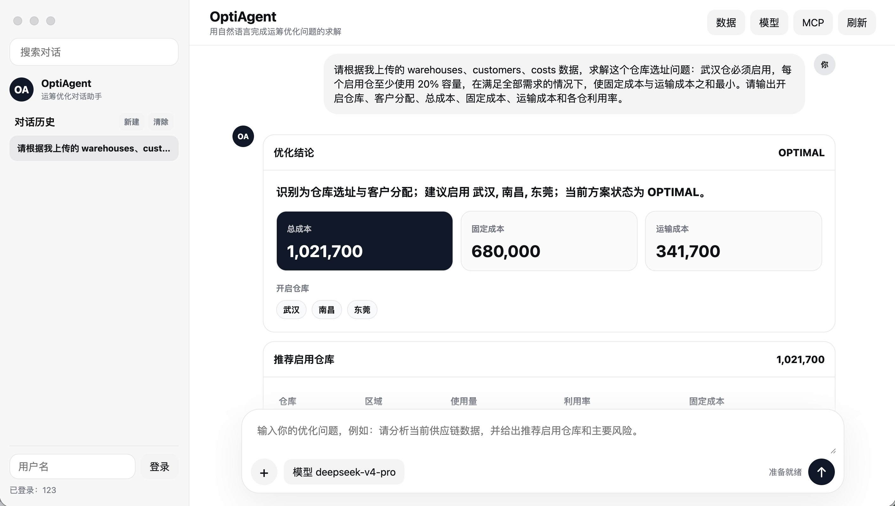
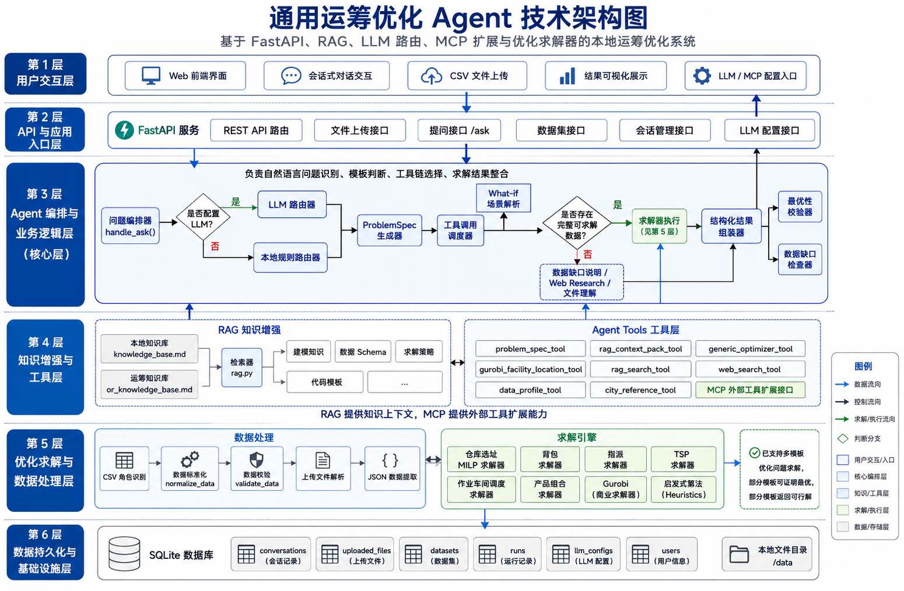

# OptiAgent

> An agentic operations-research system for learning how to model, route tools, solve, verify, and recover.


OptiAgent is evolving into a research platform around **Learning an Agent Policy for Automated Optimization Modeling and Solving**. It treats optimization assistance as a sequential decision problem spanning clarification, retrieval, modeling, tool routing, solving, verification, and repair.

## Why This Repo

- It demonstrates how an OR agent can move beyond chat into actual optimization execution.
- It combines CSV/JSON ingestion, template routing, RAG, and optimization solvers in one local-first system.
- It is suitable both as a demo project and as a starting point for people building solver copilots or decision intelligence assistants.

## Who Is This For

- Developers building OR agents, optimization copilots, or decision-support assistants
- Researchers exploring LLM + optimization + RAG pipelines
- Students working on capstone projects, graduation projects, or prototypes involving natural language to optimization workflows
- Engineers who want to understand the full data flow from frontend upload to backend solving

## Demo

UI demo:



Architecture:



## Current Capabilities

- Natural language to `ProblemSpec`
- Local-rule routing with optional LLM-based routing
- Local markdown-based RAG over optimization knowledge
- CSV upload, schema inference, normalization, and validation
- Structured execution for optimization templates
- Independent constraint/objective verification with deterministic reward signals
- Built-in Document, Data, and Solver MCP servers with versioned problem/result contracts
- A conditional LangGraph workflow with Planner, Data Agent, Modeler, Solver, Verifier, Policy, and Explainer nodes
- A typed recovery policy with candidate actions, action masks, and bounded modeling/solver retries
- Live `agent_step` events and streaming answer output through `/api/ask/stream`
- Versioned episode/step storage with state-action-observation and offline-training exports
- Session-isolated file handling and SQLite persistence

## Supported Executable Templates

| Template | `template_id` | Input | Solver |
| --- | --- | --- | --- |
| Facility location and customer assignment | `facility_location` | Three CSV files: warehouses / customers / costs | Gurobi MILP |
| 0-1 knapsack | `knapsack` | JSON or CSV | Gurobi IP |
| Assignment | `assignment` | JSON or CSV | Gurobi MILP |
| Traveling salesman problem | `tsp` | JSON or CSV distance data, or coordinate CSV | Exact enumeration / Held-Karp / Gurobi MILP / local search |
| Job shop scheduling | `job_shop_scheduling` | JSON or CSV | Gurobi MILP / heuristic fallback |
| Production mix planning | `production_mix` | JSON or CSV | Gurobi LP/MILP |

## How It Works

```text
User question / uploaded data
  -> LangGraph Agent Policy
     -> Planner -> Data Agent -> Modeler
     -> Solver -> MCP Gateway -> Document / Data / Solver MCP
     -> Verifier -> Policy -> accept / retry / rebuild / terminate
     -> Explainer
  -> Persisted trajectory and structured result
```

## Repository Highlights

- [README.md](README.md): Chinese-first main project documentation
- [examples/README.md](examples/README.md): quick-start examples for visitors
- [CHANGELOG.md](CHANGELOG.md): notable project changes
- [CONTRIBUTING.md](CONTRIBUTING.md): contribution guidance
- [docs/mcp-architecture.md](docs/mcp-architecture.md): MCP contracts, tools, configuration, and security boundaries
- [docs/agent-workflow.md](docs/agent-workflow.md): observable LangGraph execution and SSE event contract
- [docs/research-direction.md](docs/research-direction.md): research question, policy formulation, reward design, and experimental roadmap
- [docs/trajectory-data.md](docs/trajectory-data.md): episode schema, lifecycle, and training export contract
- [docs/rl-environment.md](docs/rl-environment.md): action space, rewards, fault scenarios, and reproducible rollouts

## Quick Start

```bash
./start.sh
```

or

```bash
PORT=8010 ./start.sh
```

First-time setup:

```bash
python3 -m venv .venv
source .venv/bin/activate
pip install -r requirements.txt
```

Manual backend launch:

```bash
uvicorn api.main:app --reload --host 127.0.0.1 --port 8000
```

Open:

```text
http://127.0.0.1:8000
```

## Example Inputs

- Facility location: `data/facility_location_warehouses.csv`, `data/facility_location_customers.csv`, `data/facility_location_costs.csv`
- Assignment: [examples/assignment_sample.json](examples/assignment_sample.json)
- Job shop scheduling: [examples/job_shop_scheduling_sample.json](examples/job_shop_scheduling_sample.json)
- Production mix: [examples/production_mix_sample.json](examples/production_mix_sample.json)

## Recovery-policy training status

The local extension to upstream commit `8f2f19d` includes masked tabular Q-learning and checkpoint continuation. Five seeds completed 5,000 episodes each, then another 10,000 per seed: 75,000 episodes in total, without fine-tuning an LLM.

On 720 synthetic tasks generated with seeds 2000–2009, both the parent and continued policies achieved 75% overall success, 100% success on recoverable tasks, and a mean return of 0.6625, matching the rule baseline. Additional training did not improve these metrics. These are simulated recovery transitions, not real MCP/solver evaluations or evidence of out-of-distribution generalization. Production routing remains rule-based.

```bash
python scripts/train_recovery_policy.py --output artifacts/rl/recovery-qlearning-v1
python scripts/train_recovery_policy.py --resume-from artifacts/rl/recovery-qlearning-v1 --output artifacts/rl/recovery-qlearning-v2 --episodes 10000 --test-seed-start 2000
```

Training requires Python 3.11+ and Pydantic 2. Output directories must be new. Checkpoints remain local under the ignored `artifacts/rl/` directory. Continuation restores Q values and update counts, with a fresh seeded random stream. See the [training report](docs/rl-training-results.md) and [main README](README.md#强化学习训练与续训).

## Roadmap

- Build an optimization-agent trajectory dataset from observable graph runs
- Add deterministic solution verification and verifiable reward signals
- Compare rule, LLM-planner, behavior-cloning, and offline-RL policies
- Learn tool routing, failure recovery, and budget-aware solver portfolio selection
- Extend the benchmark to VRP/VRPTW, network flow, staff scheduling, and robust optimization

## Community

If you are building OR agents, solver copilots, or optimization-aware decision systems, this repo is meant to be a practical base for extension and experimentation.
