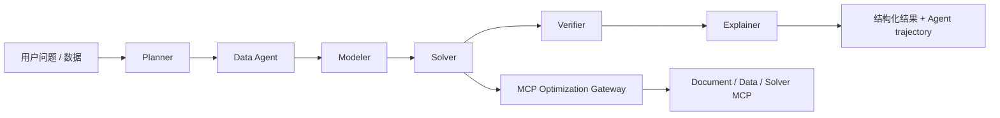

# OptiAgent Agent 工作流

## 目标

第一周把原先集中在 `handle_ask()` 中的过程迁移为一个可观测的 LangGraph 状态图，同时保持已有 API、MCP Gateway、求解器和前端样式兼容。它是后续采集 trajectory、计算 reward 和学习 Agent policy 的基础。

## 当前状态图



| 节点 | 当前职责 | 主要输出 |
| --- | --- | --- |
| Planner | 读取会话上下文，识别求解意图与问题模板 | `AskExecutionContext` |
| Data Agent | 判断数据来自数据集、上传文件、内联 JSON 或对话 | `data_context` |
| Modeler | 构建标准化 `ProblemSpec` | `problem_spec` |
| Solver | 复用现有回答链路，经 MCP Gateway 调用确定性求解器 | `result` |
| Verifier | 检查响应合同和求解状态字段 | `verification` |
| Explainer | 汇总结论并附加验证信息 | 最终响应 |

## AgentState

状态在节点之间显式传递，核心字段包括：

- `question`：用户自然语言问题。
- `execution_context`：Planner 生成的数据集、文件、LLM 路由和求解意图上下文。
- `data_context`：Data Agent 输出的数据来源摘要。
- `problem_spec`：Modeler 生成的结构化问题定义。
- `result`：Solver 返回的兼容现有前端的结果。
- `verification`：Verifier 的检查结论。
- `trace_nodes`：使用 reducer 追加的节点完成记录。

## 实时事件协议

`POST /api/ask/stream` 在原有 SSE 协议上增加 `agent_step`：

```json
{
  "node_id": "solver",
  "label": "Solver",
  "description": "通过 MCP Gateway 执行求解",
  "sequence": 4,
  "status": "completed",
  "detail": "OPTIMAL · 目标值 13.00",
  "elapsed_ms": 67.83
}
```

每个节点至少发出 `running` 和 `completed`；异常节点发出 `failed`。事件顺序为：

```text
status -> agent_step* -> answer_delta* -> final
```

前端收到事件后更新同一条消息中的六阶段执行轨道。最终响应中的 `agent_graph` 会写入 SQLite，因此刷新页面后仍可恢复完整轨迹。`GET /api/agent/graph` 返回静态节点清单，便于其他客户端预绘制状态图。

## 当前边界

- 现在是确定性的线性图，尚未加入条件边、循环修复和人工澄清分支。
- Verifier 当前检查响应合同，不等价于数学上的解可行性验证。
- Modeler 已生成 `ProblemSpec`，但部分旧求解路径仍会在内部重新做一次模板适配。
- 当前 policy 由规则与可选 LLM 组成，还没有训练 RL policy。

这些边界会直接转化为下一阶段工作：Solution Verifier、trajectory store、条件分支、失败恢复和 policy learning。

## 代码入口

- `api/services/agent_workflow.py`：状态、节点、事件包装器与图编译。
- `api/services/ask_service.py`：可复用的 Planner 上下文与现有业务求解链路。
- `api/main.py`：普通 API、SSE 队列和图清单接口。
- `web/app.js`：实时事件消费与历史轨迹渲染。
- `tests/test_agent_workflow.py`：节点顺序、持久化、SSE 和自然语言路由回归测试。
