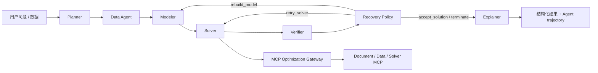

# OptiAgent Agent 工作流

## 目标

第一周把原先集中在 `handle_ask()` 中的过程迁移为一个可观测的 LangGraph 状态图，同时保持已有 API、MCP Gateway、求解器和前端样式兼容。它是后续采集 trajectory、计算 reward 和学习 Agent policy 的基础。

## 当前状态图



| 节点 | 当前职责 | 主要输出 |
| --- | --- | --- |
| Planner | 读取会话上下文，识别求解意图与问题模板 | `AskExecutionContext` |
| Data Agent | 判断数据来自数据集、上传文件、内联 JSON 或对话 | `data_context` |
| Modeler | 构建标准化 `ProblemSpec` | `problem_spec` |
| Solver | 复用现有回答链路，经 MCP Gateway 调用确定性求解器 | `result` |
| Verifier | 检查响应合同，并读取独立数学验算结果计算终局 reward | `verification` |
| Policy | 从受约束候选动作中选择接受、重试求解、重建模或终止 | `route_action` / `policy_decisions` |
| Explainer | 汇总结论并附加验证信息 | 最终响应 |

## AgentState

状态在节点之间显式传递，核心字段包括：

- `question`：用户自然语言问题。
- `execution_context`：Planner 生成的数据集、文件、LLM 路由和求解意图上下文。
- `data_context`：Data Agent 输出的数据来源摘要。
- `problem_spec`：Modeler 生成的结构化问题定义。
- `result`：Solver 返回的兼容现有前端的结果。
- `verification`：Verifier 的检查结论。
- `model_attempt` / `solver_attempt`：建模和求解的有界尝试次数。
- `policy_decisions`：候选动作、action mask、实际动作和决策依据。
- `trace_nodes`：使用 reducer 追加的节点完成记录。

## 实时事件协议

`POST /api/ask/stream` 在原有 SSE 协议上增加 `agent_step`：

```json
{
  "node_id": "solver",
  "label": "Solver",
  "description": "通过 MCP Gateway 执行求解",
  "sequence": 4,
  "status": "completed",
  "detail": "OPTIMAL · 目标值 13.00",
  "elapsed_ms": 67.83
}
```

每个节点至少发出 `running` 和 `completed`；异常节点发出 `failed`。事件顺序为：

```text
status -> agent_step* -> answer_delta* -> final
```

前端收到事件后更新同一条消息中的七阶段执行轨道。实时视图保持职责节点顺序，历史视图使用 `transition_sequence` 显示实际重试路径。最终响应中的 `agent_graph` 会写入 SQLite，因此刷新页面后仍可恢复完整轨迹。

每次工作流还会创建独立 `agent_episode_id`。节点开始时保存 policy state 和 action，节点结束时保存 observation、耗时、状态和可选 reward；工作流异常也会持久化失败 step 与 `-1.0` 终局奖励。完整数据合同见 [Trajectory 数据文档](trajectory-data.md)。

## SolutionVerifier 与 reward

Solver MCP 在返回 `SolveEnvelope` 前，会将原始 `ProblemEnvelope.data` 和求解决策交给独立 `SolutionVerifier`。验证器不信任求解器返回的 `objective_value` 或统计指标，而是重新计算：

- 背包：0-1 决策、容量与总价值；
- 指派：任务覆盖、资源唯一性与总成本；
- TSP：闭合回路、节点唯一访问、边合法性与总距离；
- 作业车间调度：工序覆盖、前置关系、机器不重叠与 makespan；
- 产品组合：数量边界、整数性、资源容量与总利润；
- 仓库选址：启用决策、需求满足、容量、最低利用率、强制开关仓与总成本。

LangGraph Verifier 将响应合同、终局状态、数学可行性和目标一致性合成为 `reward.version=1.0`。当前满分为 `1.0`，各分量均写入结果，便于后续训练和消融实验复算。它是确定性的终局奖励，还不是已训练 policy 的训练日志。

## 当前边界

- 现在已加入 Verifier 后的条件边和有界恢复回路；当前仍是确定性 baseline，尚未由参数化 policy 选择动作。
- `rebuild_model` 会把 Verifier 反馈送回 Modeler；当前模板建模器是确定性的，后续需接入可编辑模型草案才能产生更丰富的修复行为。
- Verifier 已覆盖当前六类模板的可行性和目标值复算，但不会重新求解问题来独立证明全局最优性。
- Modeler 已生成 `ProblemSpec`，但部分旧求解路径仍会在内部重新做一次模板适配。
- 当前 Recovery Policy 是可替换的规则策略，还没有训练 RL policy。

这些边界会直接转化为下一阶段工作：条件分支、失败恢复、policy baseline 和离线学习实验。

## 代码入口

- `api/services/agent_workflow.py`：状态、节点、事件包装器与图编译。
- `api/services/ask_service.py`：可复用的 Planner 上下文与现有业务求解链路。
- `optiagent/agent_policy.py`：候选动作合同与确定性恢复 baseline。
- `optiagent/solution_verifier.py`：六类模板的独立数学验算。
- `api/main.py`：普通 API、SSE 队列和图清单接口。
- `web/app.js`：实时事件消费与历史轨迹渲染。
- `tests/test_agent_workflow.py`：节点顺序、持久化、SSE 和自然语言路由回归测试。
