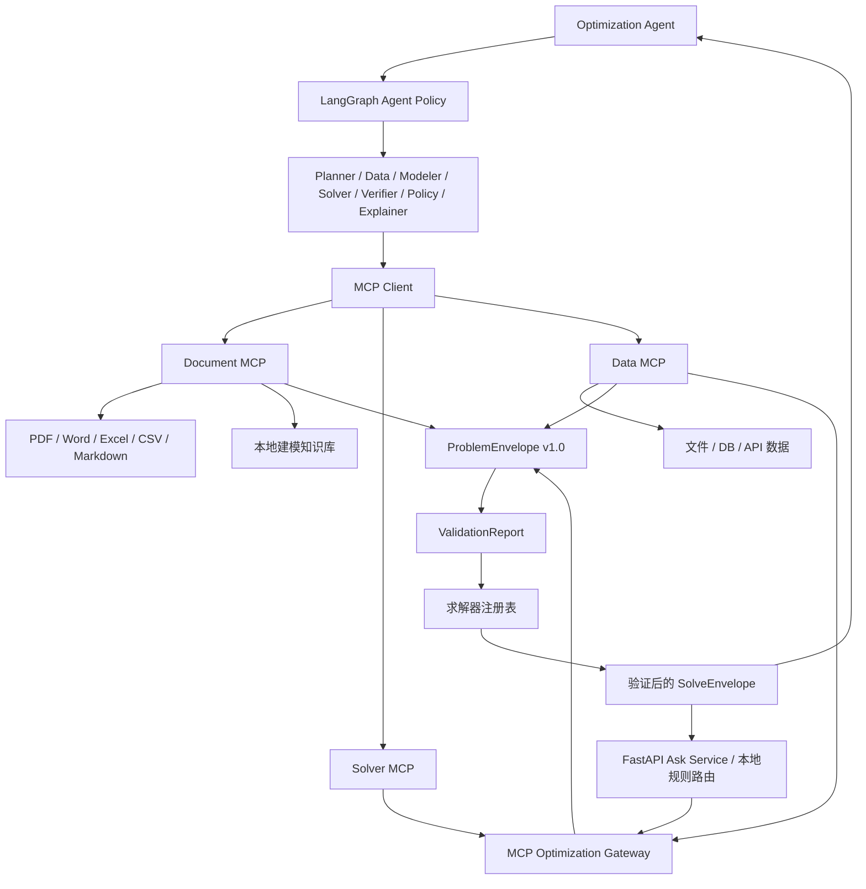

# OptiAgent MCP 架构

## 目标架构



Agent policy 负责规划、建模语义和工具路由；当前 Verifier 后的 Recovery Policy 会在受约束动作集中选择接受、重试求解、重建模或终止，并保存候选动作与 action mask。数据字段校验与求解器调用仍是确定性代码，不由 LLM 临时生成。

LangGraph 状态图和实时事件协议见 [Agent 工作流文档](agent-workflow.md)，策略学习的研究问题见 [研究方向文档](research-direction.md)。

## Gateway 迁移状态

当前以下求解入口已完成迁移：

- 上传 CSV 后的背包、指派、TSP、作业车间调度和产品组合求解。
- 用户问题内嵌 JSON 的通用求解。
- 仓库选址的基线场景、what-if 场景和 Agent 工具调用。
- 未配置 LLM 时的本地规则求解。
- Solver MCP 的远程工具调用。

上述入口都使用 `ProblemEnvelope -> ValidationReport -> SolveEnvelope` 链路。本地请求使用进程内传输，避免为每次 Web 请求创建子进程；LLM 和外部客户继续使用 stdio 或 Streamable HTTP。两种传输共用相同 Gateway 实现。

## 统一合同

`ProblemEnvelope` 是三类 MCP 之间的唯一公共问题格式：

- `schema_version`：当前为 `1.0`。
- `problem_spec`：问题类型、目标、变量、约束、数据要求和推荐求解器。
- `data`：按模板标准化后的数据。
- `sources`：文件、数据库、API 或内联数据的来源。
- `validation`：错误、警告和可审计的前置检查。

`SolveEnvelope` 统一返回求解状态、目标值、决策、指标、警告和数据溯源。`INVALID_DATA` 表示请求在启动求解器前已被拦截。

## 内置 MCP 工具

| 服务 | 工具 | 职责 |
| --- | --- | --- |
| Document MCP | `document_read` | 读取 PDF、Word、Excel、CSV、JSON、Markdown 和文本 |
| Document MCP | `document_search_knowledge` | 检索项目内建模、Schema 与求解知识 |
| Document MCP | `document_extract_problem` | 从文档生成不含虚构数据的 `ProblemEnvelope` |
| Data MCP | `data_profile` | 生成字段、缺失值、重复行和数值分布画像 |
| Data MCP | `data_build_problem` | 映射 CSV / Excel / JSON 到标准化问题数据 |
| Data MCP | `data_validate_problem` | 不启动求解器的前置校验 |
| Solver MCP | `solver_list_capabilities` | 返回已注册模板和求解器能力 |
| Solver MCP | `solver_validate_problem` | 在求解边界再次校验合同 |
| Solver MCP | `solver_solve_problem` | 路由到 Gurobi、精确算法或启发式求解器 |
| Solver MCP | `solver_verify_solution` | 独立复算约束、目标值和结果一致性 |

MCP Client 会给工具加上服务前缀，例如 `solver_solver_solve_problem`，避免外部服务出现同名工具时相互覆盖。`solver_solve_problem` 的返回值也会自动附带同一验证报告，因此 Agent 可以选择原子化调用验证工具，也可以使用求解与验证一体化路径。

## 运行方式

页面 MCP 配置留空时，启用 LLM 的 Agent 会自动发现三个内置 stdio 服务。也可以单独启动：

```bash
python -m optiagent.mcp_servers.document_server
python -m optiagent.mcp_servers.data_server
python -m optiagent.mcp_servers.solver_server
```

外部服务可与内置服务合并：

```json
{
  "include_builtin": true,
  "servers": {
    "external_data": {
      "transport": "streamable_http",
      "url": "https://example.com/mcp"
    }
  }
}
```

要完全关闭内置服务，将 `include_builtin` 设为 `false` 并在 `servers` 中提供至少一个外部服务。

## 安全边界

- Document/Data MCP 默认只能读取项目目录内的文件。
- 可通过 `OPTIAGENT_MCP_ALLOWED_ROOTS` 增加允许的读取根目录，多个目录使用操作系统路径分隔符。
- Solver MCP 不读取任意路径，只消费 `ProblemEnvelope.data`。
- 网络部署时建议在反向代理层配置身份认证，并将三个服务分配到不同端口。

## 验证

```bash
python -m unittest discover -s tests
python -m compileall api optiagent
node --check web/app.js
```
