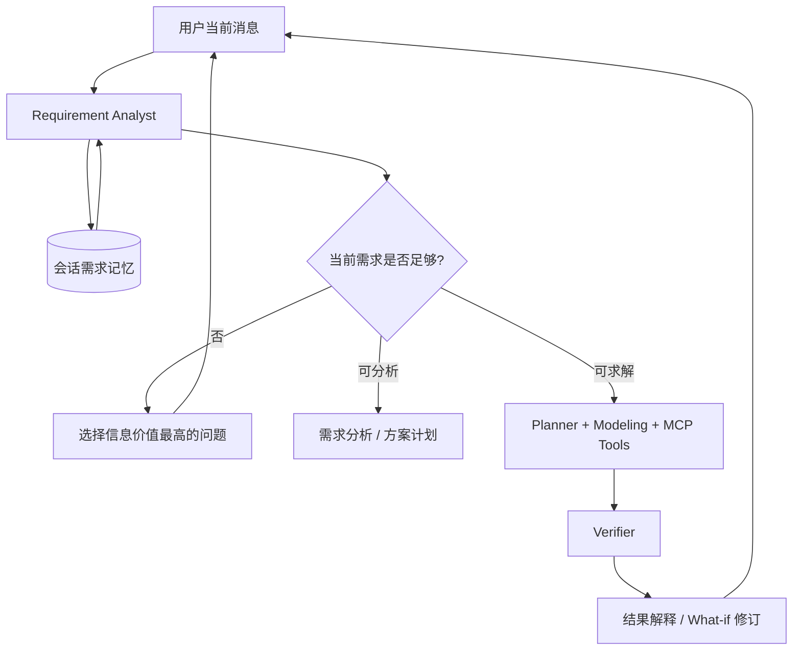

# OptiAgent 多轮对话 Agent 开发路线

## 目标

这条路线要把 OptiAgent 从“用自然语言触发求解器”升级为“能与用户共同完成优化需求定义、建模、求解和方案修订的 Agent”。

核心研究对象不是单轮回答质量，而是 policy 在一个会话 episode 中的序列决策：

$$
π(a_t \mid s_t),\quad
a_t \in \{\text{ask},\text{analyze},\text{retrieve},\text{model},\text{solve},\text{verify},\text{revise},\text{explain}\}
$$

## 目标交互

## 分阶段计划

### P1：需求状态与求解门控（已实现）

- 新增会话级 `RequirementBrief`，持久化问题类型、意图、目标、约束、已知事实、数据来源、假设和未决问题。
- 在 LangGraph 入口新增 Requirement Analyst。
- 信息不足时路由至 Explainer 主动追问，不调用 Solver。
- 用户补充数据后，合并历史目标和约束再进入原有求解链。
- 前端展示需求摘要、已确认约束、信息缺口和针对性问题。

### P2：可编辑的需求合同（基础范围已实现）

2026-09-23：五类内联 JSON 模板已支持有效输入持久化、完整数据替换、版本记录、暂停求解和撤销；背包支持自然语言容量替换。不支持的后续编辑会请求澄清。任意约束的 add/remove、字段级通用编辑与长会话压缩仍待扩展。

- 支持“把预算改成 20 万”、“删除必须启用 A 仓”、“先不求解，只比较方案”等显式状态操作。
- 将需求变更表示为 `add / replace / remove / confirm`，保留变更日志和来源轮次。
- 在进入高成本求解前生成简短执行计划，对高影响假设请用户确认。
- 为长对话增加压缩摘要，同时保留结构化字段和证据来源。

### P3：会话内方案分支与 What-if（结果比较已实现）

2026-09-23：已支持最近两个同模板、验算通过方案的目标值与输入变化比较，以及结果 JSON 下载。历史任意分支和方案命名尚未实现。验收与运行方式见 [Demo 交付说明](demo-release.md)。

- 将每次求解结果作为可引用 artifact，支持“和上一个方案比较”。
- 从基准需求派生 what-if 分支，避免临时修改覆盖原始方案。
- 让 Explainer 输出影响来源：哪个参数或约束导致了目标值和可行性变化。

### P4：可学习的对话 Policy

- 将 `ask / proceed / retrieve / confirm / revise / stop` 定义为受 action mask 约束的高层动作。
- 用确定性规则和人工标注轨迹进行行为克隆预热，再使用离线 RL 优化长期结果。
- 奖励优先来自可执行验证：需求完整度、无效工具调用、求解成功、数学验证、澄清轮数和用户更正。
- 与当前 Recovery Policy 分层：Dialogue Policy 负责需求阶段，Recovery Policy 负责建模求解后的重试与修复。

## 评测指标

| 维度 | 指标 | 目标 |
| --- | --- | --- |
| 需求理解 | slot precision / recall，用户更正率 | 不编造约束，不丢失用户已确认信息 |
| 对话效率 | 平均澄清轮数，重复问题率 | 尽量一次问高信息价值问题 |
| 工具决策 | 无效 Solver/MCP 调用率 | 信息不足时不调用高成本工具 |
| 任务结果 | 建模成功率、可行解率、验证通过率 | 对话与求解使用同一终局信号 |
| 可学习性 | 状态覆盖率、非法动作率、离线回放收益 | 每个对话决策都可审计和重现 |

## 最近的实现顺序

1. 为 `RequirementBrief` 增加字段级 provenance 和变更操作。
2. 建立 30–50 条两轮到五轮的需求澄清 benchmark。
3. 为 Dialogue Policy 实现 Rule / Random Valid / BC 三个 baseline。
4. 将对话终局奖励与现有 Solver/Verifier reward 联合，再决定是否引入 DQN 或 offline actor-critic。

该顺序优先确保“状态合同和评测环境可信”，再训练 policy，避免学到只对少量手工测试有效的追问规则。
